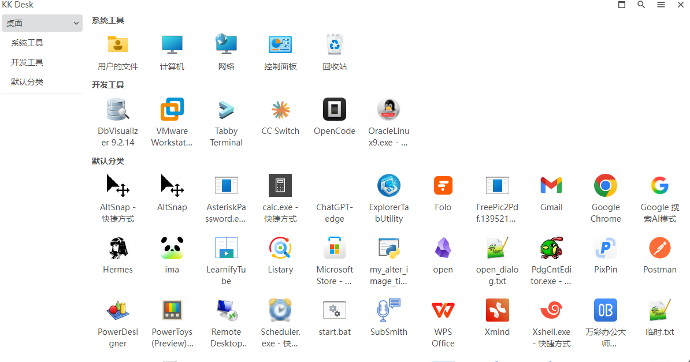

# KK Desk

[English](README.md) · [简体中文（规范源）](README.zh-CN.md) · [繁體中文](docs/README.zh-TW.md) · [日本語](docs/README.ja.md) · [한국어](docs/README.ko.md) · [Español](docs/README.es.md) · [Français](docs/README.fr.md) · [Deutsch](docs/README.de.md) · [Русский](docs/README.ru.md)

KK Desk 是一款面向 Windows 10/11 的快捷启动工具，和桌面实时同步，可以在本工具中直接启动桌面上的图标

## 核心功能
1. **与桌面图标实时同步，不用回到桌面，就能启动桌面上的程序。** 
	- 你是否同时打开了很多窗口，并放在不同的位置（特别是多屏幕的使用者），然后你想打开桌面上的某个图标时，你需要win+d回到桌面，打开图标后，你的窗口分布信息就消失了，无法恢复，你只能一个一个手工还原，这个时候你可以使用本工具，在本工具中直接打开桌面上的图标，你不需要win+d回到桌面，你就不会丢失你的窗口分布信息。
2. **支持将桌面图标进行分类**
	- 未分类的桌面图标，默认位于【默认分类】这个子分类中，可以在KK Desk的desktop这个分类中，新建子分类，然后将【默认分类】中的图标挪动到各子分类，就实现了桌面图标分组功能了，这个分组只是KK Desk内部中的，不影响真实桌面
## demo

## 项目来源与上游的关系

本项目 fork 自 [Dawn Launcher](https://github.com/fanchenio/DawnLauncher) **v1.5.2**（上游标签 [`1.5.2`](https://github.com/fanchenio/DawnLauncher/releases/tag/1.5.2)，对应本仓库历史提交 `ac36714`）。这是独立维护的非官方分支，与原项目没有隶属或官方授权关系。

相较于上游 v1.5.2，本分支重点修改：
- 新增**关联桌面及桌面图标同步**（本项目核心改造）
- 国际化，支持多种语言
- 修改图标右键菜单，改为与win 11桌面上直接右键图标的菜单一致
- 一些细节

其余功能，都是原项目本身就支持了，相关说明可参阅本仓库保存的[上游中文文档](upstream/README.md)和[上游英文文档](upstream/README-ENGLISH.md)。

## 如何安装

[版本包地址](https://github.com/laikang287/kk-desk/releases)，是便携版，其中运行时产生的配置数据，位于安装目录的`data` 目录中

## 许可与致谢

代码采用 MIT 许可，详见 [LICENSE](../2_项目/99999999_归档/20260315-科技筑梦_创新成长_陈启航/codex生成的/node_modules/lie/license.md)。原项目的版权与许可声明予以保留；来源说明见 [NOTICE.md](NOTICE.md)。感谢 Dawn Launcher 原作者与贡献者。

## 注意事项
- 以中文文档为主，其它文档基于中文文档使用AI翻译，后续若有更新，优先更新中文、英文文档